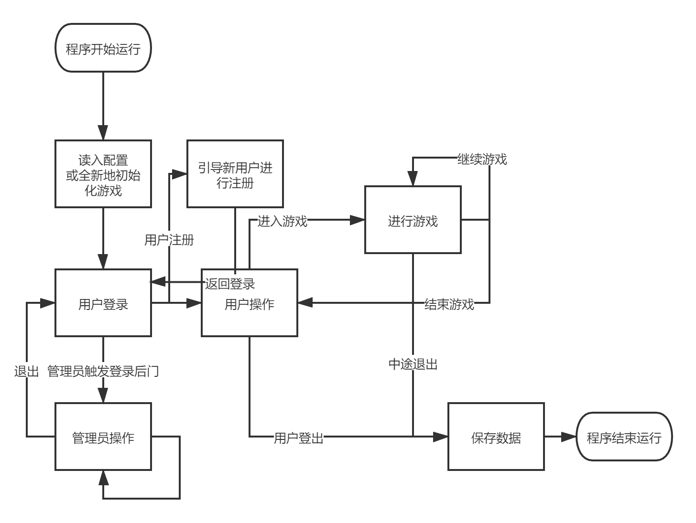

# ChessVersus 双人棋类线下竞技游戏

## 需求概述

程序实现一个带管理员后台、支持多用户、支持双人同玩的CLI棋类游戏。游戏实现了3种兼顾易上手性与可玩性的双人棋类游戏。

### 游戏系统需求

- 管理员后台及管理员对游戏系统、游戏数据的操作
- 游戏数据，游戏进度支持保存、读取
- 多用户系统

### 游戏主体需求

- 实现翻转棋、五子棋、移子棋
- 双人游戏
- 支持中途退出游戏并保存，支持从上次游戏进度恢复游戏

### 玩家需求

- 查看个人信息，维护个人信息
- 查看游戏记录

## 程序流程



## 架构设计

### 源文件

#### graph.cpp

在控制台窗口绘图

```c++
void DrawConsole(vector< vector<char> > new_graph);
void DrawConsole(char[][] new_graph);
```

根据传入参数在控制台绘图

#### game.cpp

游戏主要内容，调用`graph.cpp`进行绘图，`getch()`获取键盘事件并作出响应

```c++
GameRecord NewReversi(GameStatus &new_status);//翻转棋
GameRecord NewGomoku(GameStatus &new_status);//五子棋
GameRecord NewMove(GameStatus &new_status);//移子棋
```

在`main.cpp`中调用函数开启新游戏，并引用一个`struct GameStatus`在游戏中途退出时用于保存游戏进度。正常结束游戏返回`struct GameRecord`游戏记录

#### main.cpp

实现游戏的初始化（从配置或全新初始）、游戏的保存

```c++
void GameInitialize();
void GameSave();
```

读取保存有规定的格式

`int main()`实现登入过程、管理员后台、调用游戏和对游戏结果进行处理

### 头文件

#### player.h

定义用户类

```c++
struct PlayerInfo
{
	int id_;
	string name_;
	string password_;
};

class Player
{
public:

private:
	vector <PlayerInfo> all_player;
};
```

#### record.h

定义游戏记录（特指正常结束的游戏）结构

```c++
struct Record
{
	tm time;
	int game_id;
	int player1_id;
	int player2_id;
	int winner;
};
```

游戏记录包括游戏时间，游戏类型，两玩家的id，获胜情况（平局或某一方胜利）

#### status.h

定义游戏状态（特指中途退出游戏时的状态）结构

```c++
struct Status
{
	tm  time;
	int game_id;
	int player1_id;
	int player2_id;
	vector< vector<char> > status;
	int next_player;
};
```

游戏状态包括游戏时间，游戏类型，两玩家的id，棋局状况，下一位出手的玩家

### 资源文件

#### game.data（可选）

游戏配置文件

初始化游戏时，优先读入此文件

退出游戏时，将游戏保存入此文件

#### game_template.data（可选）

游戏模板配置文件

初始化游戏时，若同级目录找不到`game.data`则尝试在同级目录寻找此文件并读入此文件初始化游戏

### 数据结构

优先使用向量`vector`存储数据

`class Player`中`vector <PlayerInfo> all_player`储存所有玩家信息

`vector <Record> record`储存所有游戏记录